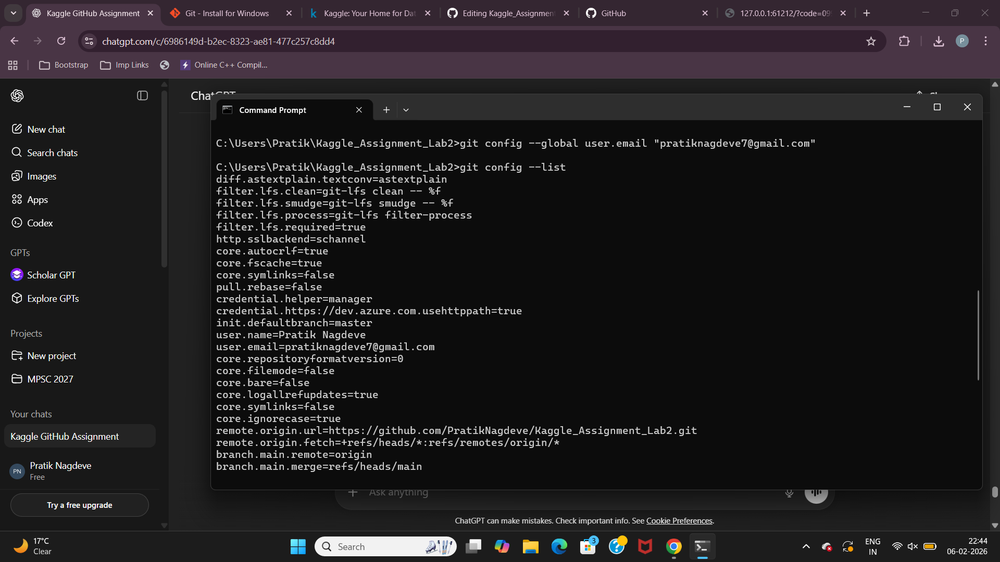
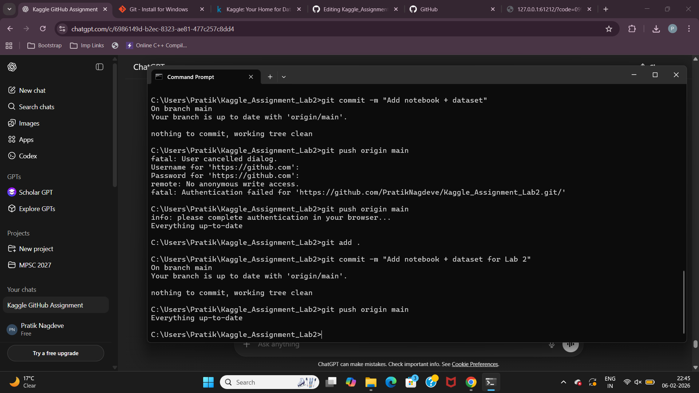

# Kaggle_Assignment_Lab2

## Objective
This assignment demonstrates the use of Git and GitHub for version control of a Kaggle notebook and dataset.

## Steps Performed

 Cloned the GitHub repository to local machine:
```bash
git clone https://github.com/PratikNagdeve/Kaggle_Assignment_Lab2.git

Added the assignment notebook and dataset:
git add .
git commit -m "Add notebook + dataset for Lab 2"

Pushed changes to GitHub:
git push origin main

Proof of Commands
Below is the terminal output showing the successful execution of the commands:
## Proof of Commands

Below is a screenshot showing the successful execution of Git commands in Command Prompt:



### Additional Proof of Commands

Another screenshot showing successful Git operations:



